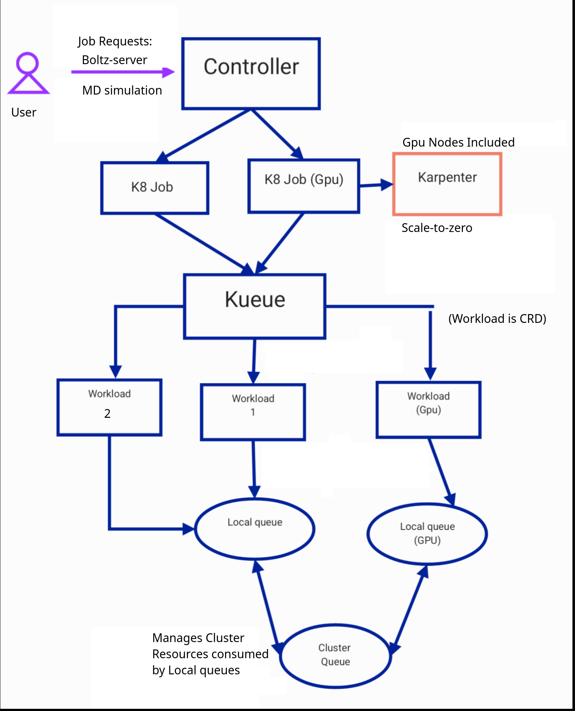

This is a comprehensive guide detailing Cedana's current managed workload creation, automation, and management framework. 
Key infrastructure design priorities:

- Auto-scaling architecture supporting various AMIs with targeted CPU/GPU instance selection
- Queue-based job scheduling system utilizing Kueue for customer workloads, controller-initiated with future propagator triggering for multi-cluster support
- Automated node migration with checkpoint restoration and spot interruption handling (in development)

# Design

Some of the components involved in the system include:

- Nodepool: Refers to an Ec2NodeClass kubernetes resource kind.
- Ec2 Node Class: Contains specifications such as ami, instance-type, and other ec2 instance related information.
- Local Queue: A queue scoped to a specific namespace, used by workloads to request resources.
- Cluster Queue: A global queue that aggregates multiple local queues, managing resource allocation at the cluster level.
- Workload: A representation of a job or task that needs resources and waits in a queue until resources are available.

<figure><figcaption>

</figcaption></figure>

We also allow you to store and access files running inside your workload through s3 bucket volume mounts. 

## Final Design

Here we create two workloads. Since the clusterqueue resource limit is set to 64 cores and the job requests 32 cores each, We are able to admit two jobs based on the configuration. The pods are in pending state waiting for karpenter nodepool to spin up nodes.

<figure><figcaption>

</figcaption></figure>

On creating a third job, you will notice that it gets listed onto `pending` Workloads. You will also notice that the gromacs job is in `suspended` state, therefore no pod is spawned and nodepool will not be triggered to create a new instance. Once the previous two jobs complete we schedule the third job in one of running instances.

<figure><figcaption>

</figcaption></figure>

## Alternatives Considered

- Cluster autoscaler: This is an alternative to Karpenter. One main issue with using cluster autoscaler is granularity. While cluster autoscaler requires us to create managed node groups and only then scale nodes based on requirement, Karpenter creates nodes based on requirement and assigns an adequate instance type (as specified in ec2nodeclass)

# References

- [https://karpenter.sh/docs/concepts/nodepools/](https://karpenter.sh/docs/concepts/nodepools/)
- [https://kueue.sigs.k8s.io/docs/concepts/](https://kueue.sigs.k8s.io/docs/concepts/)
